# Biểu đồ Use Case (Mermaid Diagrams)

Dưới đây là các biểu đồ Use Case sử dụng cú pháp Mermaid cho các chức năng được yêu cầu: Xem trang chủ, Xem danh mục sản phẩm, Xem blog, Xem giới thiệu, Liên hệ, và Quản lý tài khoản.

## 1. Xem Trang Chủ (View Homepage)

Biểu đồ mô tả các tương tác của người dùng khi truy cập vào trang chủ của hệ thống, bao gồm việc xem banner và các sản phẩm nổi bật/đại diện.

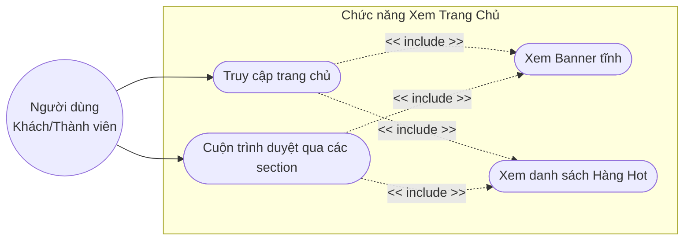

### Đặc tả Use Case: Xem Trang Chủ

| Thuộc tính | Mô Tả |
| :
## 7. Thanh toán (Checkout)

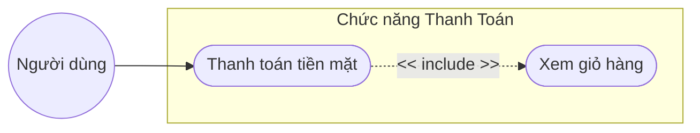

### Đặc tả Use Case: Thanh toán tiền mặt

| Thuộc tính | Mô Tả |
| :--- | :--- |
| **Tên chức năng** | Thanh toán tiền mặt |
| **Chức năng của module** | Cho phép người dùng thực hiện đặt hàng bằng hình thức trả tiền khi nhận hàng (COD). |
| **Mô tả nghiệp vụ** | **Người dùng:** - Truy cập trang Giỏ hàng. - Kiểm tra danh sách sản phẩm: Tên, Size, Số lượng, Đơn giá. - Có thể thay đổi size, tăng/giảm số lượng hoặc xóa sản phẩm (Hệ thống tự cập nhật lại Tổng cộng). - Nhấn nút "Thanh toán tiền mặt". **Hệ thống:** - Kiểm tra trạng thái giỏ hàng (nếu rỗng thì báo lỗi). - Hiển thị form "Thông tin đặt hàng" để người dùng nhập: Họ tên, Số điện thoại, Địa chỉ, Ghi chú. **Xác nhận:** - Người dùng nhấn "Xác nhận". - Hệ thống lưu đơn hàng vào Cơ sở dữ liệu với trạng thái "Chờ xử lý/Thanh toán khi nhận hàng". |
| **Tác nhân** | Người dùng (đã đăng nhập) |
| **Điều kiện kích hoạt** | Người dùng nhấn vào nút "Thanh toán tiền mặt" tại trang Giỏ hàng. |
| **Điều kiện trước** | - Hệ thống hoạt động bình thường - Người dùng đã đăng nhập vào hệ thống - Giỏ hàng phải có ít nhất 1 sản phẩm |
| **Điều kiện sau** | - Thông tin đơn hàng được lưu thành công vào hệ thống. - Giỏ hàng của người dùng được làm trống. - Nếu đặt hàng thành công hiển thị thông báo và quay lại trang quản lý giỏ hàng. |
| **Ngoại lệ** | - Giỏ hàng rỗng thì không cho thanh toán - Người dùng bỏ trống các trường bắt buộc |

--- | :--- |
| **Tên chức năng** | Xem Trang Chủ |
| **Chức năng của module** | Hiển thị giao diện trang chủ đập vào mắt người dùng đầu tiên, bao gồm Banner tĩnh và giới thiệu các sản phẩm đại diện (Hàng Hot). |
| **Mô tả nghiệp vụ** | **Người dùng:** - Truy cập vào đường dẫn gốc (domain) của hệ thống. - Cuộn (scroll) qua các khối section trên trang. **Hệ thống:** - Tự động nạp file `trangchu.php`. - Tải và hiển thị các thành phần tĩnh (Header, Menu, Footer, Banner). - Truy vấn cơ sở dữ liệu để lấy danh sách sản phẩm nổi bật (Hàng Hot, LIMIT 4). - Render giao diện và hiển thị cho người dùng. |
| **Tác nhân** | Người dùng (Khách/Thành viên) |
| **Điều kiện kích hoạt** | Người dùng truy cập đường dẫn gốc (domain) của website hoặc click vào Logo trang chủ. |
| **Điều kiện trước** | - Hệ thống đang hoạt động bình thường. - Có kết nối mạng. |
| **Điều kiện sau** | - Giao diện trang chủ (Banner, Hàng Hot) được hiển thị đầy đủ. - Trạng thái hệ thống không thay đổi. |
| **Ngoại lệ** | - Chưa có sản phẩm trong CSDL: Vùng Hàng Hot để trống hoặc hiển thị "Đang cập nhật", không gây lỗi trang. - Mất kết nối CSDL: Trả về trang bảo trì. |

## 2. Xem danh mục sản phẩm (View Product Category)

Biểu đồ mô tả các tương tác của người dùng (bao gồm khách vãng lai và thành viên) khi duyệt qua các danh mục sản phẩm của cửa hàng.

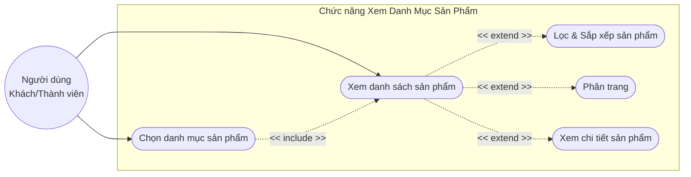

### Đặc tả Use Case: Xem danh mục sản phẩm

| Thuộc tính | Mô Tả |
| :--- | :--- |
| **Tên chức năng** | Xem danh mục sản phẩm |
| **Chức năng của module** | Cho phép người dùng duyệt qua các danh mục sản phẩm, xem danh sách, chi tiết sản phẩm, lọc, sắp xếp và phân trang. |
| **Mô tả nghiệp vụ** | **Người dùng:** - Truy cập trang chủ hoặc trang cửa hàng. - Chọn một danh mục sản phẩm cụ thể (VD: Điện thoại). - (Tùy chọn) Chọn bộ lọc (theo giá, thương hiệu) hoặc sắp xếp (A-Z, Giá tăng/giảm). - (Tùy chọn) Chọn phân trang để xem các trang tiếp theo. - Click vào một sản phẩm để xem chi tiết. **Hệ thống:** - Tiếp nhận ID/Slug danh mục và truy vấn CSDL. - Hiển thị danh sách sản phẩm thuộc danh mục đó. - Cập nhật lại danh sách sản phẩm ngay lập tức nếu người dùng chọn bộ lọc hoặc sắp xếp. - Hiển thị chi tiết sản phẩm khi người dùng click vào. |
| **Tác nhân** | Người dùng (Khách/Thành viên) |
| **Điều kiện kích hoạt** | Người dùng chọn một danh mục sản phẩm từ menu hoặc trang cửa hàng. |
| **Điều kiện trước** | - Hệ thống hoạt động bình thường. |
| **Điều kiện sau** | - Danh sách sản phẩm thuộc danh mục được hiển thị chính xác theo yêu cầu (kèm bộ lọc/sắp xếp). |
| **Ngoại lệ** | - Không có sản phẩm nào trong danh mục: Hiển thị thông báo "Hiện chưa có sản phẩm nào trong danh mục này". - Danh mục không tồn tại: Điều hướng về trang lỗi 404. |

## 3. Xem Blog (View Blog)

Biểu đồ mô tả quá trình người dùng truy cập và đọc các bài viết tin tức/blog trên hệ thống.

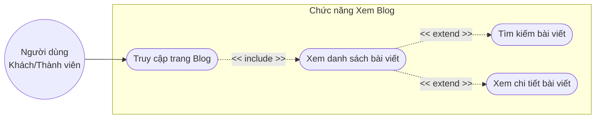

### Đặc tả Use Case: Xem Blog

| Thuộc tính | Mô Tả |
| :--- | :--- |
| **Tên chức năng** | Xem Blog |
| **Chức năng của module** | Cho phép người dùng đọc các bài viết tin tức, blog trên hệ thống và tìm kiếm bài viết. |
| **Mô tả nghiệp vụ** | **Người dùng:** - Truy cập vào trang Blog. - (Tùy chọn) Nhập từ khóa vào ô tìm kiếm bài viết. - Click vào tiêu đề hoặc ảnh đại diện của một bài viết để đọc nội dung chi tiết. **Hệ thống:** - Truy vấn CSDL, lấy danh sách các bài viết mới nhất (đã xuất bản). - Hiển thị danh sách bài viết (Ảnh thumbnail, tiêu đề, tóm tắt, ngày đăng). - Lọc và hiển thị kết quả nếu người dùng thực hiện tìm kiếm. - Render nội dung chi tiết của bài viết khi người dùng click vào. |
| **Tác nhân** | Người dùng (Khách/Thành viên) |
| **Điều kiện kích hoạt** | Người dùng chọn chức năng "Blog" trên menu. |
| **Điều kiện trước** | - Hệ thống hoạt động bình thường. |
| **Điều kiện sau** | - Danh sách bài viết hoặc nội dung chi tiết bài viết được hiển thị thành công. |
| **Ngoại lệ** | - Không có bài viết nào: Hiển thị thông báo "Chưa có bài viết nào được đăng". - Tìm kiếm không ra kết quả: Hiển thị "Không tìm thấy bài viết nào phù hợp". |

## 4. Xem Giới Thiệu (Brand & Team Members)

Biểu đồ mô tả tương tác khi người dùng tìm hiểu về thông tin thương hiệu và các thành viên.

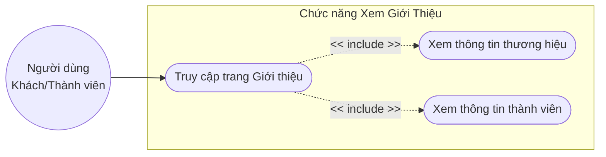

### Đặc tả Use Case: Xem Giới Thiệu

| Thuộc tính | Mô Tả |
| :--- | :--- |
| **Tên chức năng** | Xem Giới Thiệu |
| **Chức năng của module** | Cung cấp thông tin về thương hiệu, lịch sử hình thành và đội ngũ thành viên của cửa hàng. |
| **Mô tả nghiệp vụ** | **Người dùng:** - Click vào liên kết "Giới thiệu" trên menu chính hoặc footer. - Cuộn trang để đọc thông tin doanh nghiệp và xem đội ngũ nhân sự. **Hệ thống:** - Nhận yêu cầu và tải nội dung text, hình ảnh liên quan đến giới thiệu công ty. - Truy vấn CSDL hoặc file cấu hình để lấy dữ liệu các thành viên nổi bật trong đội ngũ. - Render giao diện và hiển thị trang Giới thiệu cho người dùng. |
| **Tác nhân** | Người dùng (Khách/Thành viên) |
| **Điều kiện kích hoạt** | Người dùng click vào liên kết "Giới thiệu" trên menu hoặc footer. |
| **Điều kiện trước** | - Hệ thống hoạt động bình thường. |
| **Điều kiện sau** | - Trang giới thiệu hiển thị đầy đủ thông tin thương hiệu và thành viên. |
| **Ngoại lệ** | - Lỗi truy xuất danh sách thành viên: Phần giới thiệu chung vẫn hiển thị bình thường, phần danh sách thành viên báo lỗi hoặc ẩn đi. |

## 5. Liên Hệ (Contact)

Biểu đồ mô tả hành động gửi thông tin liên hệ, phản hồi từ người dùng tới ban quản trị cửa hàng.

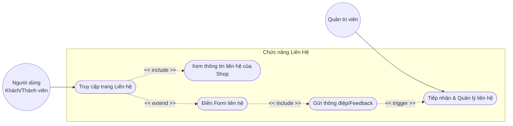

### Đặc tả Use Case: Liên Hệ

| Thuộc tính | Mô Tả |
| :--- | :--- |
| **Tên chức năng** | Liên Hệ |
| **Chức năng của module** | Cho phép người dùng xem thông tin liên hệ của cửa hàng và gửi tin nhắn, phản hồi đến ban quản trị. |
| **Mô tả nghiệp vụ** | **Người dùng:** - Truy cập trang Liên hệ. - Xem các thông tin liên lạc (SĐT, Email, Địa chỉ, Bản đồ). - Điền đầy đủ thông tin vào Form liên hệ: Họ tên, Email, Tiêu đề, Nội dung. - Nhấn nút "Gửi". **Hệ thống:** - Hiển thị giao diện trang Liên hệ và Form điền thông tin. - Nhận dữ liệu Form, tiến hành kiểm tra tính hợp lệ (Validate). - Lưu nội dung thông điệp vào CSDL và gửi thông báo cho admin (nếu có cấu hình). - Hiển thị thông báo gửi thành công cho người dùng. |
| **Tác nhân** | Người dùng (Khách/Thành viên), Admin (Tiếp nhận) |
| **Điều kiện kích hoạt** | Người dùng truy cập trang "Liên hệ" và quyết định điền form gửi phản hồi. |
| **Điều kiện trước** | - Hệ thống hoạt động bình thường. |
| **Điều kiện sau** | - Thông điệp được lưu trữ thành công vào hệ thống để Admin xử lý. |
| **Ngoại lệ** | - Dữ liệu form không hợp lệ (Email sai định dạng, thiếu nội dung): Hệ thống hiển thị thông báo yêu cầu nhập đúng định dạng. |

## 6. Quản Lý Tài Khoản (Account Management)

Phần Quản lý tài khoản bao gồm các chức năng dành riêng cho người dùng đã đăng nhập (Thành viên). Dưới đây là biểu đồ Use Case và đặc tả chi tiết cho từng chức năng nhỏ.

### 6.1. Cập nhật thông tin cá nhân

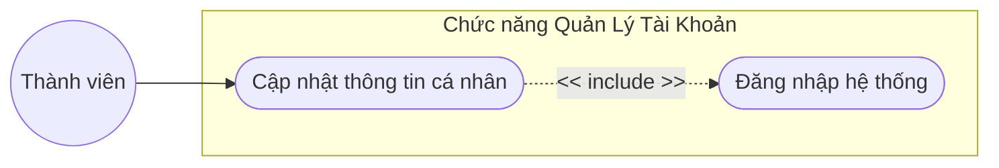

#### Đặc tả Use Case: Cập nhật thông tin cá nhân

| Thuộc tính | Mô Tả |
| :--- | :--- |
| **Tên chức năng** | Cập nhật thông tin cá nhân |
| **Chức năng của module** | Cho phép thành viên đã đăng nhập chỉnh sửa và cập nhật các thông tin cá nhân của mình. |
| **Mô tả nghiệp vụ** | **Người dùng:** - Truy cập trang "Quản lý tài khoản" -> "Cập nhật thông tin". - Xem thông tin hiện tại trên Form. - Chỉnh sửa các trường dữ liệu: Họ tên, Số điện thoại, Địa chỉ... - Nhấn nút "Lưu thay đổi". **Hệ thống:** - Hiển thị màn hình quản lý tài khoản kèm Form đã điền sẵn dữ liệu hiện tại. - Khi người dùng nhấn lưu, hệ thống kiểm tra validate dữ liệu đầu vào (Ví dụ: SĐT phải là số). - Thực thi cập nhật thông tin mới vào CSDL. - Hiển thị thông báo "Cập nhật thông tin thành công". |
| **Tác nhân** | Thành viên (Người dùng đã đăng nhập) |
| **Điều kiện kích hoạt** | Người dùng click vào chức năng "Cập nhật thông tin" trong trang tài khoản. |
| **Điều kiện trước** | - Hệ thống hoạt động bình thường. - Người dùng đã đăng nhập thành công. |
| **Điều kiện sau** | - Thông điệp cập nhật thành công được hiển thị, CSDL cập nhật thông tin. |
| **Ngoại lệ** | - Dữ liệu nhập không hợp lệ (SĐT sai định dạng, thiếu thông tin bắt buộc): Báo lỗi ngay trên Form, yêu cầu nhập lại. |

### 6.2. Đổi mật khẩu

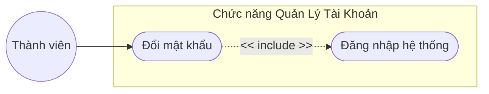

#### Đặc tả Use Case: Đổi mật khẩu

| Thuộc tính | Mô Tả |
| :--- | :--- |
| **Tên chức năng** | Đổi mật khẩu |
| **Chức năng của module** | Cho phép thành viên thay đổi mật khẩu đăng nhập để bảo mật tài khoản. |
| **Mô tả nghiệp vụ** | **Người dùng:** - Truy cập chức năng "Đổi mật khẩu". - Nhập Mật khẩu hiện tại, Mật khẩu mới và Xác nhận mật khẩu mới vào Form. - Nhấn nút "Cập nhật mật khẩu". **Hệ thống:** - Hiển thị Form đổi mật khẩu. - Tiếp nhận dữ liệu, mã hóa Mật khẩu hiện tại và đối chiếu với CSDL. - Kiểm tra Mật khẩu mới và Xác nhận mật khẩu có trùng khớp không. - Nếu hợp lệ, hệ thống mã hóa Mật khẩu mới và ghi đè vào CSDL. - Hiển thị thông báo "Đổi mật khẩu thành công". |
| **Tác nhân** | Thành viên (Người dùng đã đăng nhập) |
| **Điều kiện kích hoạt** | Người dùng chọn chức năng "Đổi mật khẩu" trong trang quản trị cá nhân. |
| **Điều kiện trước** | - Hệ thống hoạt động bình thường. - Người dùng đã đăng nhập thành công. |
| **Điều kiện sau** | - Mật khẩu mới được cập nhật và có thể dùng cho lần đăng nhập kế tiếp. |
| **Ngoại lệ** | - Sai mật khẩu hiện tại: Thông báo "Mật khẩu hiện tại không chính xác". - Mật khẩu mới không trùng khớp: Thông báo "Xác nhận mật khẩu mới không khớp". |

### 6.3. Xem lịch sử mua hàng

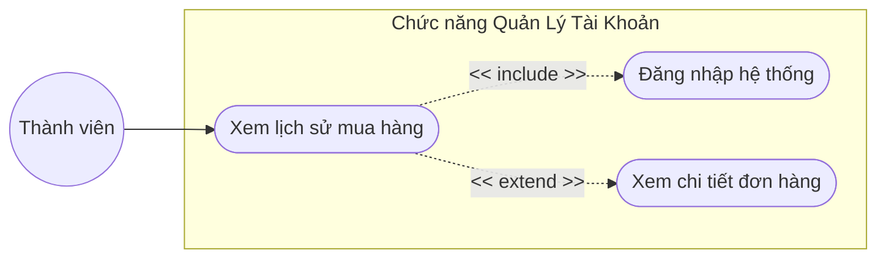

#### Đặc tả Use Case: Xem lịch sử mua hàng

| Thuộc tính | Mô Tả |
| :--- | :--- |
| **Tên chức năng** | Xem lịch sử mua hàng |
| **Chức năng của module** | Hiển thị danh sách các đơn hàng đã đặt của thành viên cùng với chi tiết trạng thái. |
| **Mô tả nghiệp vụ** | **Người dùng:** - Truy cập mục "Lịch sử mua hàng" hoặc "Đơn hàng của tôi". - Xem danh sách tổng quan các đơn hàng. - Click vào "Xem chi tiết" (hoặc mã đơn) của một đơn hàng cụ thể. **Hệ thống:** - Lấy thông tin ID của người dùng hiện tại và truy vấn CSDL để lấy tất cả đơn hàng tương ứng. - Hiển thị danh sách đơn hàng (Mã đơn, Ngày đặt, Tổng tiền, Trạng thái đơn). - Khi người dùng chọn xem chi tiết, hệ thống truy vấn và hiển thị danh sách các sản phẩm thuộc đơn hàng đó. |
| **Tác nhân** | Thành viên (Người dùng đã đăng nhập) |
| **Điều kiện kích hoạt** | Người dùng click vào "Lịch sử đơn hàng". |
| **Điều kiện trước** | - Hệ thống hoạt động bình thường. - Người dùng đã đăng nhập thành công. |
| **Điều kiện sau** | - Danh sách đơn hàng và chi tiết đơn hàng được hiển thị chính xác. |
| **Ngoại lệ** | - Chưa có đơn hàng nào: Hiển thị thông báo "Bạn chưa có đơn hàng nào". |

### 6.4. Đăng xuất

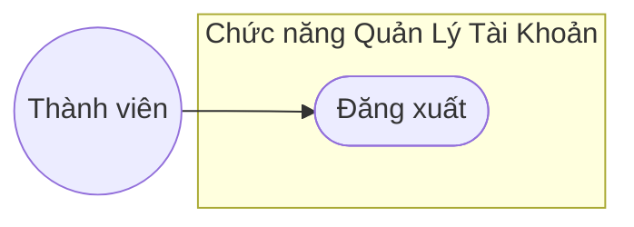

#### Đặc tả Use Case: Đăng xuất

| Thuộc tính | Mô Tả |
| :--- | :--- |
| **Tên chức năng** | Đăng xuất |
| **Chức năng của module** | Hủy bỏ phiên làm việc hiện tại của thành viên. |
| **Mô tả nghiệp vụ** | **Người dùng:** - Click vào nút "Đăng xuất" trên Header hoặc menu tài khoản. **Hệ thống:** - Xóa bỏ toàn bộ dữ liệu Session lưu trữ thông tin đăng nhập của người dùng. - Xóa Cookie ghi nhớ đăng nhập (nếu có). - Điều hướng (Redirect) người dùng trở về Trang chủ hoặc Trang đăng nhập. |
| **Tác nhân** | Thành viên (Người dùng đã đăng nhập) |
| **Điều kiện kích hoạt** | Người dùng click nút "Đăng xuất". |
| **Điều kiện trước** | - Người dùng đang ở trạng thái đã đăng nhập. |
| **Điều kiện sau** | - Phiên đăng nhập bị hủy, giao diện trở về chế độ Khách (Guest). |
| **Ngoại lệ** | - Lỗi server không thể xóa session (hiếm gặp). |

---

# Biểu đồ Hoạt động (Activity Diagrams)

Dưới đây là các biểu đồ hoạt động (Activity Diagrams) tương ứng với các luồng nghiệp vụ chính của hệ thống.

## 1. Xem Trang Chủ

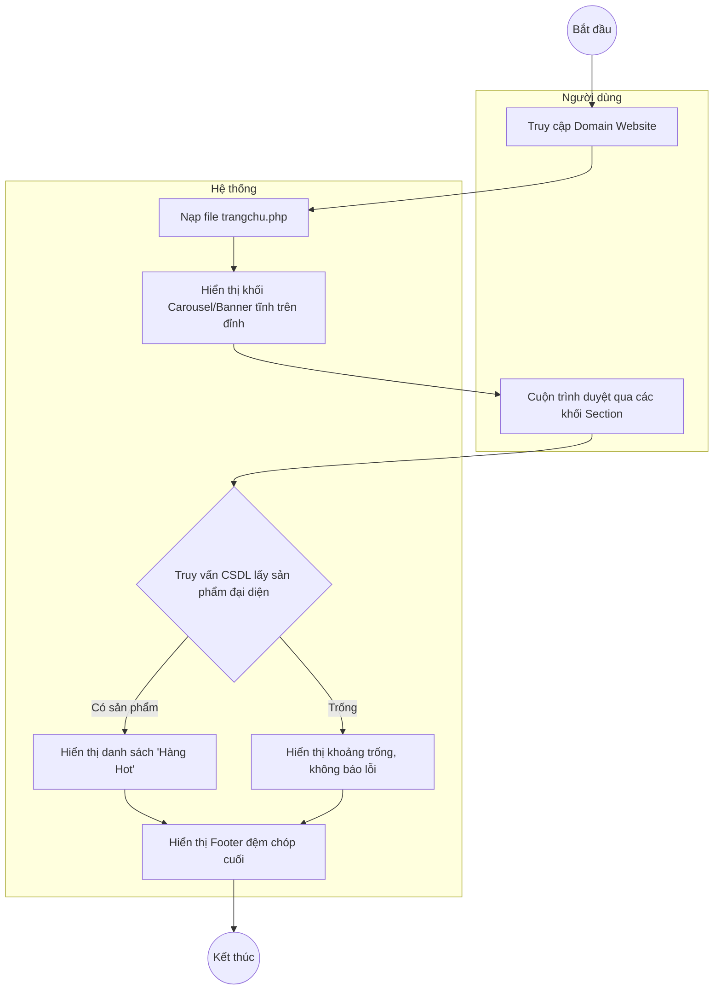

## 2. Xem danh mục sản phẩm

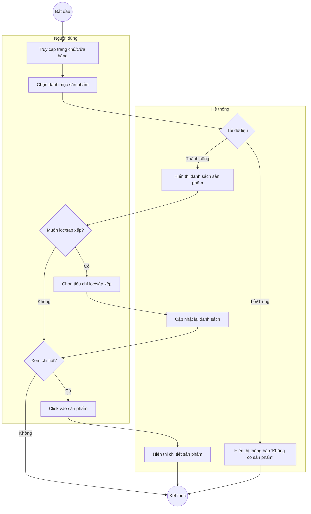

## 3. Xem Blog

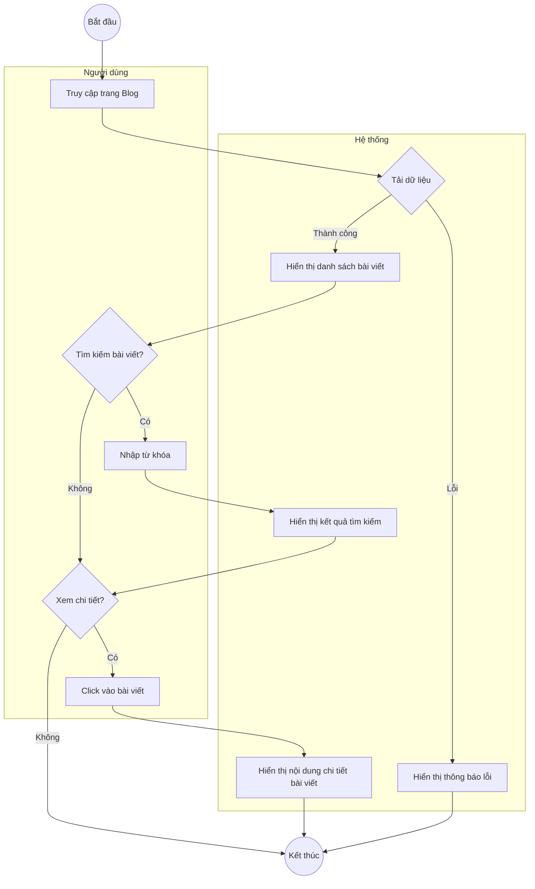

## 4. Xem Giới Thiệu

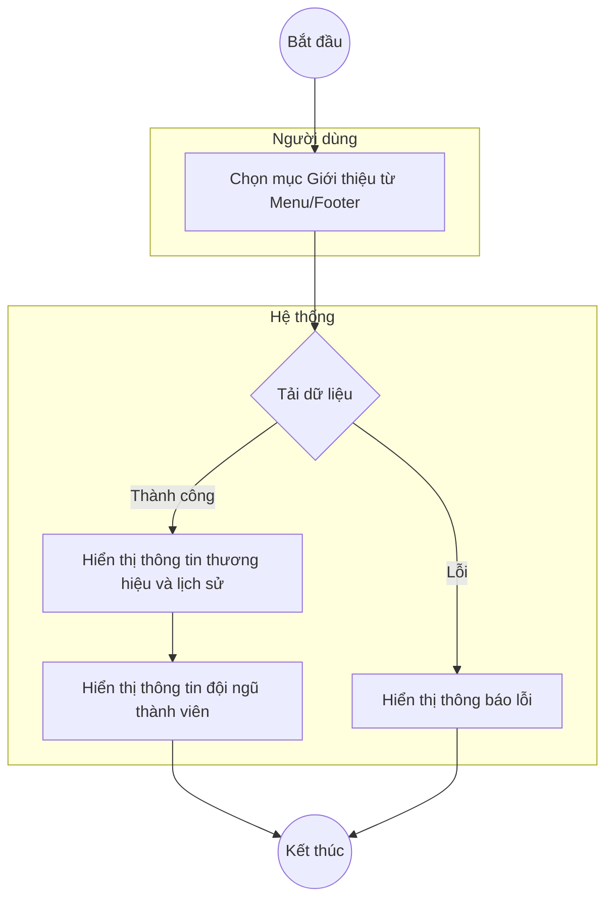

## 5. Liên Hệ

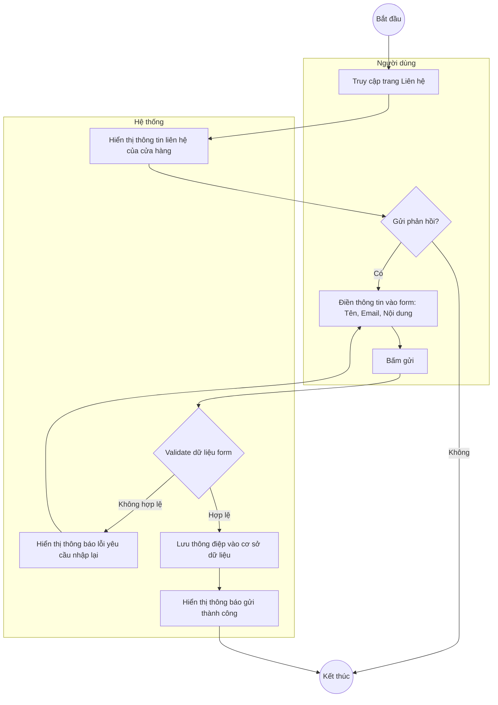

## 6. Quản Lý Tài Khoản

Phần Quản lý tài khoản được chia nhỏ thành các biểu đồ hoạt động tương ứng với từng chức năng cụ thể:

### 6.1. Cập nhật thông tin cá nhân

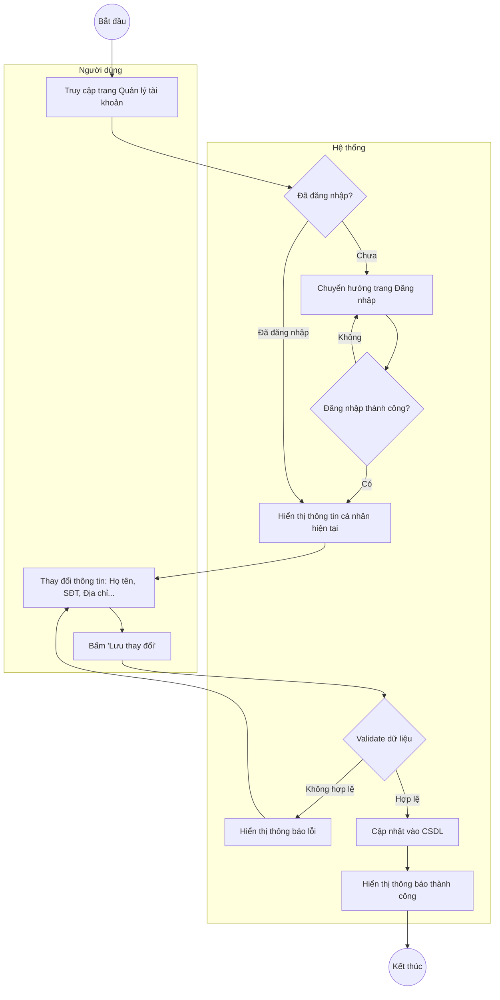

### 6.2. Đổi mật khẩu

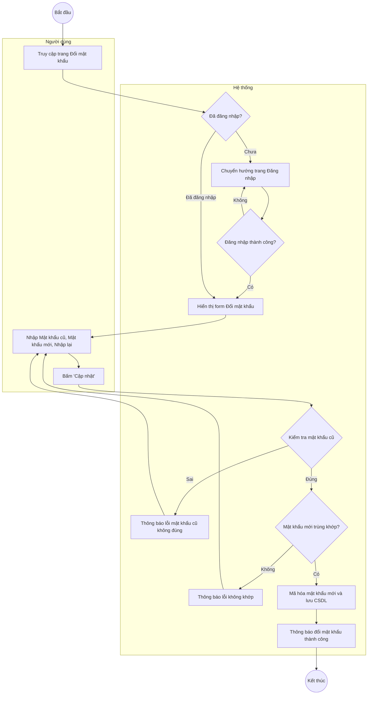

### 6.3. Xem lịch sử mua hàng

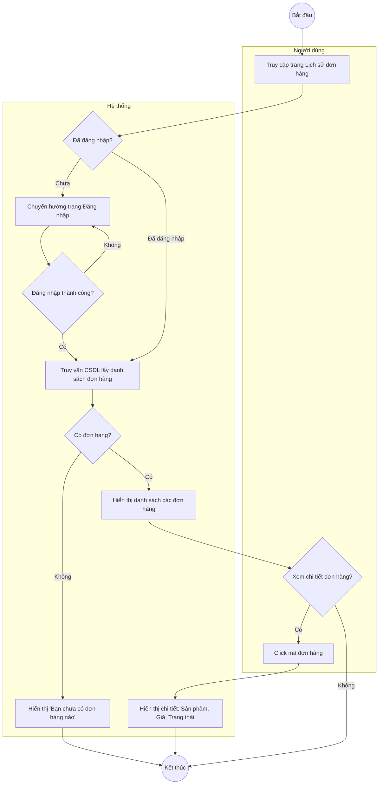

### 6.4. Đăng xuất

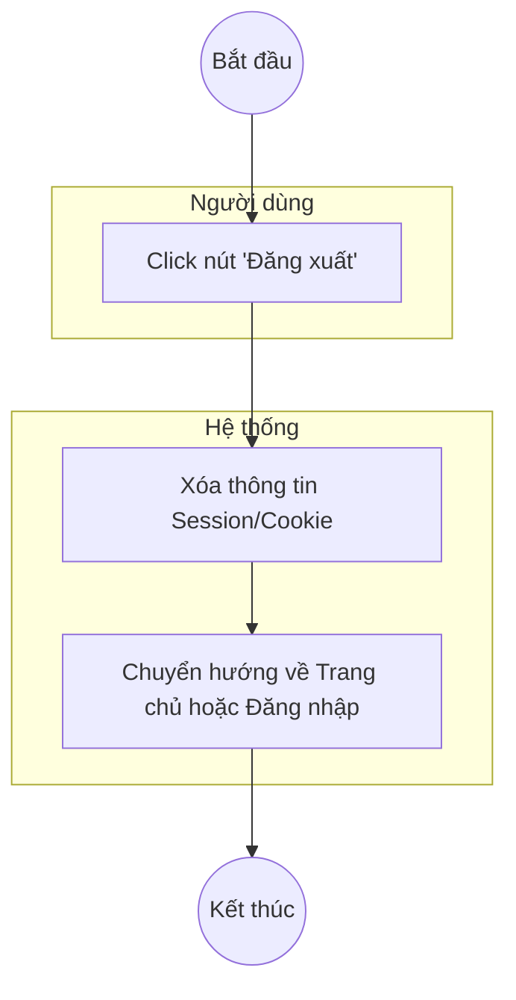

## 7. Thanh toán (Checkout)

### 7.1. Thanh toán tiền mặt (COD)

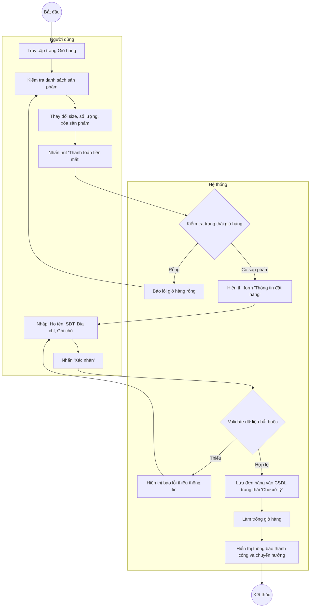
